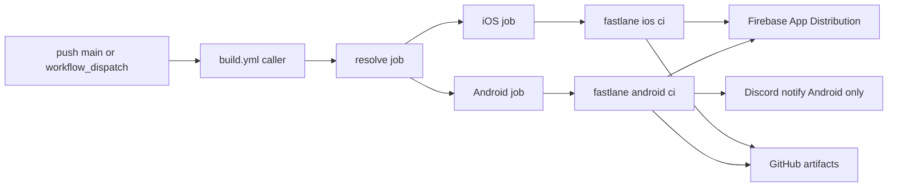

How **dev** and **beta** Android and iOS builds are produced in GitHub Actions and distributed via **Firebase App Distribution** (`xicarph---builds`).

**Caller workflow:** [`build.yml`](https://github.com/Xicar-PH/XicarHome/blob/main/.github/workflows/build.yml) (triggers \+ app inputs)

**Shared pipeline:** [`flutter-mobile-build.yml`](https://github.com/xicar-ph/workflows/blob/main/.github/workflows/flutter-mobile-build.yml) (resolve, Android, iOS jobs)

**Fastlane:** [`fastlane/Fastfile`](https://github.com/Xicar-PH/XicarHome/blob/main/fastlane/Fastfile)

Related docs: [Secrets](/ci-cd/secrets) · [Firebase Distribution](/ci-cd/firebase-distribution) · [iOS CI](/ci-cd/ios)

---

## Overview

The caller workflow in the XicarHome repo triggers a shared reusable workflow that builds **Android** (`ubuntu-latest`) and **iOS** (`macos-latest`) in parallel. Fastlane materializes secrets, signs builds, uploads to Firebase App Distribution (dev/beta only), and writes GitHub Actions artifacts. Secrets stay in the app repo and are inherited by the shared workflow via `secrets: inherit`.

**Two Firebase projects:**

| Project | Role |
| --- | --- |
| `xicarv2` | Runtime config — `.env`, `google-services.json`, `GoogleService-Info.plist` |
| `xicarph---builds` | App Distribution uploads only |

---

## Triggers and flavors

| Trigger | Resolved flavor | Distributes? |
| --- | --- | --- |
| `push` to `main` | `beta` | Yes → `general-xicar-internal` |
| `workflow_dispatch` (default / `auto`) | `dev` | Yes → `general-xicar-internal` |
| `workflow_dispatch` (flavor = `beta`) | `beta` | Yes |
| `workflow_dispatch` (flavor = `dev`) | `dev` | Yes |

### Triggering manually

GitHub → **Actions** → **Build (Android \+ iOS)** → **Run workflow** → pick branch and flavor.

---

## Pipeline steps

1. **Resolve** — map event \+ input to `dev` or `beta`
2. **Android job** — `bundle exec fastlane android ci`
   - Materialize `.env`, keystore, `google-services.json`
   - `flutter build apk --release --flavor <flavor> --obfuscate`
   - Firebase App Distribution (dev/beta)
   - Upload APK, ProGuard mapping, debug symbols
   - Optional Discord webhook notification
3. **iOS job** — `bundle exec fastlane ios ci`
   - Materialize `.env`, `GoogleService-Info.plist`
   - `match adhoc` \+ manual code signing
   - `flutter build ipa --export-method ad-hoc`
   - Firebase App Distribution (dev/beta)
   - Upload IPA, debug symbols

Artifacts are retained for 30 days.

---

## Versioning

Fastlane generates timestamped versions from `pubspec.yaml` base:

| Flavor | Version name pattern |
| --- | --- |
| `dev` | `{base}-{unix_ts}-dev` |
| `beta` | `{base}-{unix_ts}-beta` |
| `prod` | `{base}-{unix_ts}`_(when enabled)_ |

Build number = unix timestamp.

---

## Distribution

Dev and beta APKs/IPAs upload to Firebase App Distribution on project `xicarph---builds`, tester group `general-xicar-internal`.

Admin setup (app IDs, service account, tester groups): [Firebase App Distribution](/ci-cd/firebase-distribution).

Required secret: `FIREBASE_APP_DIST_SERVICE_ACCOUNT_JSON`

---

## Notifications

When `DISCORD_INTERNAL_SHARING_WEBHOOK_URL` is set, the **Android** job posts the Firebase release link to Discord after a successful upload.

<Warning>
  The iOS job does not post Discord notifications today.
</Warning>

---

## Prod builds (deferred)

<Note>
  **Status: not wired.** Fastlane supports `prod`; the workflow resolve job only outputs `dev` or `beta`.
</Note>

When enabled, prod builds will be **artifacts only** — no Firebase App Distribution.

### Planned triggers

| Trigger | Flavor | Distributes? |
| --- | --- | --- |
| TBD (e.g. push to `prod` branch) | `prod` | No |
| `workflow_dispatch` (flavor = `prod`) | `prod` | No |

### Reserved secrets

| Secret | Used for |
| --- | --- |
| `PROD_ENV_FILE` | `.env` for prod |
| `PROD_ANDROID_GOOGLE_SERVICES_JSON_BASE64` | Runtime `google-services.json` |
| `PROD_IOS_GOOGLE_SERVICES_PLIST_BASE64` | Runtime `GoogleService-Info.plist` |

Local prod builds via `./tools/run.sh prod` still work.

---

## Play Store (deferred)

Google Play Internal testing is **not** the current distribution path. Beta and dev builds go to **Firebase App Distribution**.

Play Console setup is documented for future use: [Play Store (deferred)](/ci-cd/play-store).

---

## Known gaps

| Gap | Notes |
| --- | --- |
| No lint / test / format CI | No `flutter analyze`, `flutter test`, or format check |
| No PR validation | CI runs on `main` push and manual dispatch only |
| Prod not wired | See [Prod builds (deferred)](#prod-builds-deferred) |
| Play Store upload | Not implemented |
| iOS Discord | Android only |

---

## Setup references

| Topic | Doc |
| --- | --- |
| All GitHub secrets | [Secrets](/ci-cd/secrets) |
| iOS match / signing | [iOS CI](/ci-cd/ios) |
| Android keystore | [Android Keystore](/ci-cd/android-keystore) |
| Local workflow validation | [Local Testing](/ci-cd/local-testing) |

---

## See also

- [`fastlane/firebase_app_distribution.rb`](https://github.com/Xicar-PH/XicarHome/blob/main/fastlane/firebase_app_distribution.rb) — app IDs and distribution config
- [Firebase App Distribution](/ci-cd/firebase-distribution) — distribution project admin